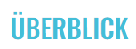

# WCIS-8 ReadMe

## Ausführen der Anwendung

- `yarn build` baut die Anwendung im `build` auf
- `yarn start` führt die Anwendung im Developer-Modus auf Port`3000` aus

## Anpassung der Inhalte in der WCIS-8

Um Anpassung in der WCIS-8 vorzunehmen müssen Bilder/Assets/Icons/Videos in `public` hinzugefügt werden und Inhalte im
`\src\icons\content.json` vorgenommen werden.

### Struktur von `public`

1) assets: Beinhaltet Assets der einzelnen Inhaltsbereiche. Die Unterordner beschreiben die Position in der WCIS8:
    - LeftTop
    - leftLeft
    - leftBottom
    - rightTop
    - rightRight
    - rightBottom
3) icons: Beinhaltet Icon für die WCIS8-Bereiche

### Sectionname und Icons der Bereiche ändern

Beispiel: 

Die WCIS-8 besteht aus insgesamt 6 Bereichen, bei denen das Icon, als auch der Name angepasst werden können.

1) Im `public\icons\`-Ordner wird das gewünschte SVG-Icon abgelegt
2) Die weitere Anpassung erfolgt im `src\icons\content.json`-File. Wechseln sie im `content.json` zum gewählten
   Abschnitt z.B. leftLeft.
3) Ändern sie den `titel`
4) Ändern sie den Pfad bei `path`für das gewünschte Icon `icons\[iconDatei]`

Beispiel: Hervohebung kann angepasst werden
   <pre>
   ...
   "leftLeft": {
      "settings": {
         "pos": [ 81, 200],
         "title": "DevOps",
         "icon": {
            "path": "./icons/DevOps.svg"
         }
      }
      ...
   }
   </pre>

### Anpassen der Labels der WCIS-8

Um die Bereich oberhalb, innerhalb und unterhalb der WCIS-8 der linken Hälfte und rechten Hälfter der 8 anzupassen: 
1) Wechseln Sie zu `labels`
2) Gehen sie in den `leftCircle` (linke Teil) oder `rightCircle` (rechter Teil)
3) In einem der beiden Kreise können sie `top`, `center` oder `bottom` wählen, genau bei jenem bei dem Sie den Text ändern möchten.
4) In den `lines` können sie den Text nun anpassen, indem sie das Array mit Inhalt befüllen.

<pre>
  ...
  "leftCircle": {
      "settings": {
        "top": {
          "lines": [
            "Project",
            "Management"
          ],
          ... 
        },...
      }
   ...
</pre>
### Anpassung der Section-Inhalte

#### Tabs

Ein Inhalt eines Section-Bereichs kann aus mehreren Tabs bestehen (siehe Bild). Diese Tabs können im `content.json`
angepasst werden.

1) Wechseln Sie im `content.json` zum gewählten Abschnitt z.B. leftLeft.
2) Beim Punkt `tabs` können Sie einzelne Tabs hinzufügen:
   <pre>
   ...
   "tabs": [
      {
         "name": "Tab 1",
         "content": [...]
      }, ...
      {
         "name": "Tab n",
         "content": [...]
      }
   ]
   ...
   </pre>
3) Passen sie den Tab nun an, in dem Sie dem Tab einen Namen `name` geben und den Content (siehe nächster Abschnitt)
   anpassen

#### Inhaltea für einen Tab wählen

Im Bereich des contents können für einen Tab unterschiedliche Möglichkeiten gewählt und gemeinsam genutzt werden werden.
Um die gewählte Möglichkeit festzulegen ändern Sie den `type` zu

- **title**: erzeugen eine Überschrift
- **text**: ein einspaltiger Text kann hinzugefügt werden
- **twoColumn**: ein zweispaltiger Text kann hinzugefügt werden
- **image**: hinzufügen eines Bildes aus dem `public\assets\[inhaltsbereich]\`
- **video**: hinzufügen eines Videos aus dem `public\assets\[inhaltsbereich]\`
- **wordCloud**: hinzufügen einer Text-Wolke

Ein Beispiel bei dem ein Content aus **Titel, Bild und Text** besteht kann wie folgt hinzugefügt werden:
   <pre>
   ...
    "content": [
            {
                "type": "title",
                "text": "Trends"
            },
            {
                "type": "image",
                "url": "/assets/rightTop/MR_details.jpg",
                "altText": ""
            },
            {
                "type": "text",
                "text": "Lorem Ipsum ..."
            }
        ]
   ...
   </pre>

##### type `titel`

Bei `text` passen sie den Überschrift-Text an.
<pre>
"content": [
   {
      "type": "title",
      "text": "Details"
   },...
]
</pre>

##### type`text`

Bei `text` (nicht verwechseln mit type) passen sie den Abschnitts-Text an.
<pre>
"content": [
   {
      "type": "text",
      "text": "Lorem ipsum..."
   },...
]
</pre>

##### type`twoColumns`

Bei `textLeft` und `textRight` passen Sie den Text der zwei Spalten an. Ein Bild kann über 'image' hinzugefügt werden.
<pre>
"content": [
   {
      "type": "twoColumn",
      "textLeft": "Lorem ...", 
      "textRight": "ixed Reality 2 ...",
      "image": {...}
   },...
]
</pre>

##### type`image`

Hier müssen sie die `url` anpassen (`public\assets\[inhaltsbereich]\`) und können einen `alt`-Text angeben.
<pre>
"content": [
   {
      "type": "image",
      "url": "/assets/rightTop/MR_details.jpg",
      "altText": ""
   },... 
]
</pre>

##### type`video`

Hier müssen sie die `url` anpassen, indem sie einen Youtube-Link angeben.
<pre>
"content": [
   {
      "type": "video",
      "url": "https://www.youtube.com/embed/QU6WyU9EYUM"
   },... 
]
</pre>

##### type`wordList`

Eine Wort-Wolke besteht aus einer `wordListe`, welche ein Array von einzelnen Elementen beinhaltet. Ein Element wiederum
wird durch seinen Inhalt `text` und einem Gewicht `weight`beschrieben. Das Gewicht ist eine natürliche Zahl und sollte
zwischen 1 und 5 gewählt werden. Umso größer das Gewicht, umso größer wird das Element dargestellt.
<pre>
"content": [
   "type": "wordCloud",
      "wordList": [
         {
            "text": "eins",
            "weight": 1
         },
         {
            "text": "zwei",
            "weight": 2
         },
         {
            "text": "drei",
            "weight": 3
         }
      ]
]
</pre>

